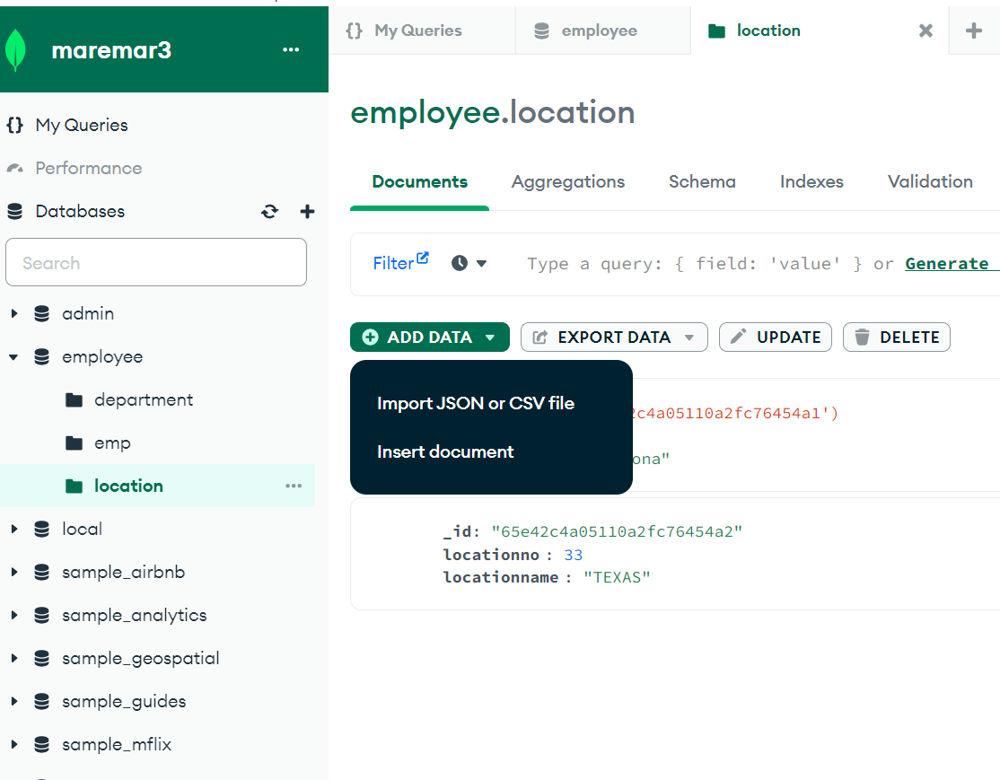
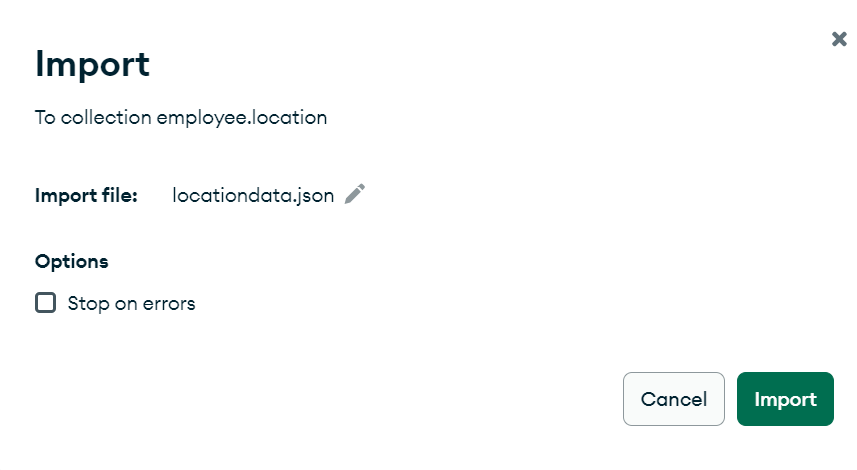

# MongoDB-Database-Application-project 
## our DB is employee:has 3 collections   
* emp for employee(id,name,deptnum) 
* department (deptnum,deptname,location) 
* location(locationno,locationname) 
_This video explain how can we insert field into collection using mongo compass_ 
https://www.youtube.com/watch?v=bJSj1a84I20 
we created empdata. Json to insert documents , then we imported it from mongodb compass(click om import then chose json file)  
To Export Jscon File from Visual Studio
1- open MongoDB compass chose your collection then press import Data then press JSON , import file , chose your JSON file 

 
2-chose import, then chose your file  
 

