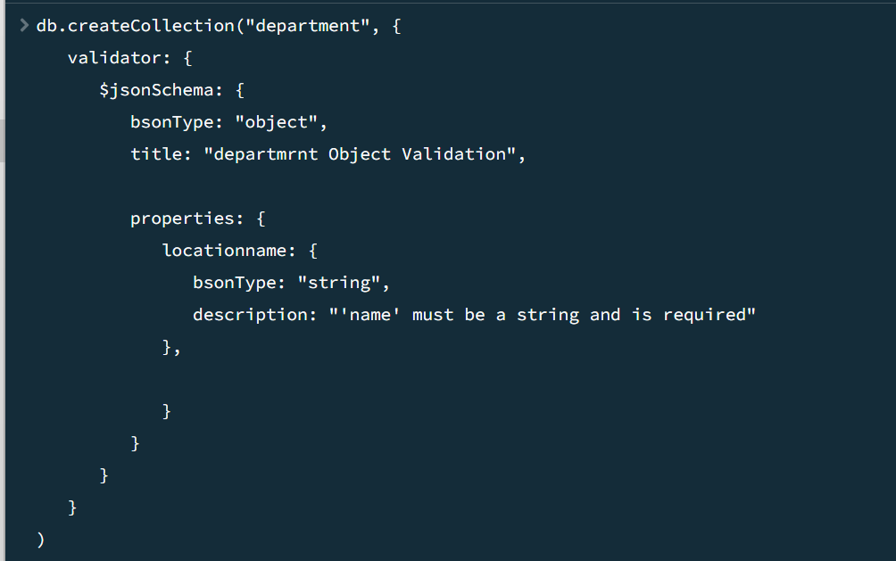
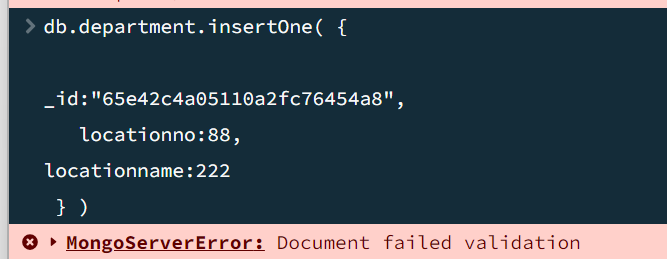
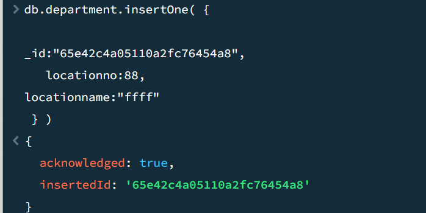

# MongoDB-Database-Application-project 
## our DB is employee:has 3 collections   
* emp for employee(id,name,deptnum) 
* department (deptnum,deptname,location) 
* location(locationno,locationname) 
## Videoes Helped me  
_TO  POST DOCUMENT_ 
https://www.youtube.com/watch?v=bJkRnvIT5jQ 
_TO DELETE DOCUMENT_ 
https://www.youtube.com/watch?v=DPHn_qs44QM 
_TO PATCH DOCUMENT_ 
https://www.youtube.com/watch?v=8wxLA_hTuSA 
_To help me on validation_ 
https://www.mongodb.com/docs/v7.0/core/schema-validation/ 
_This video explain how can we insert field into collection using mongo compass_ 
https://www.youtube.com/watch?v=bJSj1a84I20 
we created empdata. Json to insert documents , then we imported it from mongodb compass(click om import then chose json file)  
To Export Jscon File from Visual Studio, I have 3 json files departmentdata,empdta,locationdata
1- open MongoDB compass chose your collection then press import Data then press JSON , import file , chose your JSON file 

 
2-chose import, then chose your file  

 
 
*Validation* 
_To do validation write this code_  

_when I insert number to locationname it gave me that faild vlaidation_ 

_when I insert ""FFF" string for location name now the validation is success_  

